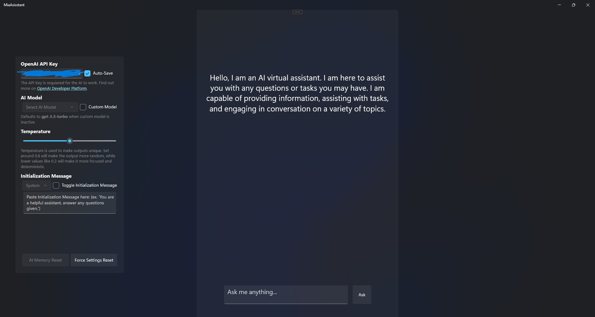

# Mia Asisstant

MiaAsisstant is a simple and still customizable chat-gpt implementation in C#. It is intended to be just an easy way to start learning about [Azure OpenAI API](https://www.nuget.org/packages/Azure.AI.OpenAI/1.0.0-beta.5?_src=template).

## Information about the project:

### Intended use:

I wanted to create an easily-understandable project that people can use to learn more about using ChatGPT in C#. It is great to understand the basics. For more information go to the [OpenAI Website](https://openai.com/) or [various sample projects available](https://platform.openai.com/examples)

### Other Information:

This project is running on the UWP Framework. It also uses [WinUI 2.8.2](https://microsoft.github.io/microsoft-ui-xaml/) for esthetical purposes. 
